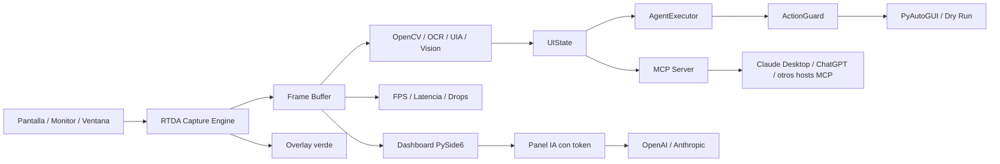

# Real-Time Desktop Agent


**Real-Time Desktop Agent (RTDA)** es un motor local para observar, medir y automatizar interfaces de escritorio en Windows 11. El proyecto combina captura de pantalla de baja latencia, buffer de frames, preview local, metricas de rendimiento, percepcion visual, UI Automation, acciones seguras y un servidor MCP para integrarse con asistentes de IA.

RTDA resuelve un problema concreto: permitir que una IA o un operador humano entienda que parte del escritorio se esta observando, mida la calidad de esa observacion y pruebe acciones de forma segura antes de ejecutar automatizacion real.

Esta pensado para desarrolladores, investigadores y builders que quieren crear agentes de escritorio locales, probar vision/automatizacion en Windows y exponer capacidades a clientes como Claude Desktop, ChatGPT u otros hosts compatibles con MCP.

## Stack Tecnologico

| Area | Tecnologias reales |
| --- | --- |
| Frontend / UI |  dashboard local, preview y overlay verde |
| Backend / Core |  `setuptools`, arquitectura `src/` |
| Computer Vision |    |
| Captura Windows | `windows-capture`, DXGI Desktop Duplication, Windows Graphics Capture, Win32 monitor/window APIs |
| IA / Agentes | Cliente OpenAI/Anthropic por HTTP, agente rule-based, MCP server |
| OCR | PaddleOCR/PaddlePaddle como extra opcional |
| Base de datos | No aplica actualmente |
| Infraestructura | Local-first; sin Docker, CI cloud ni despliegue remoto detectado |
| Herramientas |  `mcp`, `pyautogui`, `uiautomation` |

## Arquitectura



## Caracteristicas Principales

- 🟢 Marca visualmente el area observada con un marco verde.
- ⚡ Captura monitores, regiones o ventanas con DXGI/WGC en Windows 11.
- 📊 Mide FPS, resolucion, latencia, frames descartados y errores.
- 🧠 Expone un panel IA local para pruebas con token de OpenAI o Anthropic.
- 🔌 Funciona como complemento MCP para clientes externos compatibles.
- 🧭 Inspecciona UI Automation de forma acotada y estructurada.
- 🛡️ Clasifica acciones por riesgo y mantiene `dry_run` para integraciones.
- 🧪 Incluye pruebas unitarias para captura, percepcion, acciones, agente, MCP, IA y overlay.

## Instalacion y Uso

1. Clona el repositorio.

```powershell
git clone https://github.com/Adan0423/real-time-desktop-agent.git
cd real-time-desktop-agent
```

2. Crea y activa un entorno virtual.

```powershell
python -m venv .venv
.\.venv\Scripts\Activate.ps1
```

3. Instala el proyecto para captura, UI y pruebas.

```powershell
python -m pip install -e ".[capture,gui,dev]"
```

4. Ejecuta la app propia.

```powershell
python -m rtda.app.main
```

5. Ejecuta la app sin overlay verde.

```powershell
python -m rtda.app.main --hide-overlay
```

6. Lista monitores detectados.

```powershell
python -m rtda.app.main --list-monitors
```

7. Ejecuta diagnostico de captura.

```powershell
python -m rtda.app.main --capture-diagnostic --duration 4 --backend dxgi --target-fps 30
```

8. Ejecuta el servidor MCP por stdio.

```powershell
python -m rtda.mcp.server --transport stdio
```

9. Ejecuta pruebas.

```powershell
python -m pytest
```

## Variables de Entorno

RTDA no carga `.env` automaticamente. Usa estas variables si integras los clientes desde Python o si tu host MCP las inyecta.

| Variable | Descripcion | Requerida |
| --- | --- | --- |
| `OPENAI_API_KEY` | Token para llamadas al proveedor OpenAI desde `AIClientConfig.from_env()` | Opcional |
| `ANTHROPIC_API_KEY` | Token para llamadas al proveedor Anthropic desde `AIClientConfig.from_env()` | Opcional |
| `RTDA_AI_PROVIDER` | Proveedor IA por defecto: `openai` o `anthropic` | Opcional |
| `RTDA_BACKEND` | Default documentado para captura (`dxgi`/`wgc`); usa `--backend` en CLI | Opcional |
| `RTDA_TARGET_FPS` | Default documentado de FPS; usa `--target-fps` en CLI | Opcional |
| `RTDA_MONITOR_INDEX` | Default documentado de monitor; usa `--monitor-index` en CLI | Opcional |

## Estructura de Carpetas

```text
real-time-desktop-agent/
├── src/rtda/
│   ├── ai/              # Cliente OpenAI/Anthropic usado por la app propia
│   ├── app/             # CLI y dashboard PySide6
│   ├── capture/         # ScreenCapture, DXGI/WGC, buffer y diagnosticos
│   ├── overlay/         # Marco verde y geometria monitor/region/ventana
│   ├── perception/      # OpenCV, UIA, OCR y vision model adapters
│   ├── actions/         # Comandos, resolucion y executor PyAutoGUI
│   ├── safety/          # Politicas de riesgo y confirmacion
│   ├── agent/           # Observe -> plan -> act -> verify -> recover
│   ├── mcp/             # Servidor MCP para Claude/hosts compatibles
│   ├── models/          # Modelos de datos Pydantic/dataclasses
│   ├── performance/     # Metricas de captura y procesamiento
│   └── state/           # Estado observable del agente
├── docs/                # Documentacion tecnica y roadmap
├── tests/               # Suite pytest
├── packaging/mcpb/      # Manifiesto base para Claude Desktop MCPB
├── .env.example         # Variables opcionales de referencia
├── mcpb_server.py       # Entrypoint stdio para bundle MCPB
├── pyproject.toml       # Dependencias y metadata del paquete
└── LICENSE              # Licencia MIT con autoria de Adan0423
```

## Roadmap / Estado

El estado por modulo vive en [docs/PROGRESS.md](docs/PROGRESS.md) y los pendientes priorizados en [docs/TODO.md](docs/TODO.md).

## Complemento Claude Desktop

Claude Desktop instala complementos locales arrastrando un archivo `.mcpb`. `.dxt` fue el nombre anterior del formato; Anthropic recomienda `.mcpb` para paquetes nuevos.

RTDA ya incluye un manifiesto base en [packaging/mcpb/manifest.json](packaging/mcpb/manifest.json) y un entrypoint en [mcpb_server.py](mcpb_server.py). El empaquetado final requiere el CLI oficial `mcpb`.

## Licencia y Contacto

Este proyecto es open source bajo licencia MIT.

Copyright (c) 2026 **Adan0423**.

Contacto configurado del proyecto: `Atrinidad.a4@gmail.com`.
