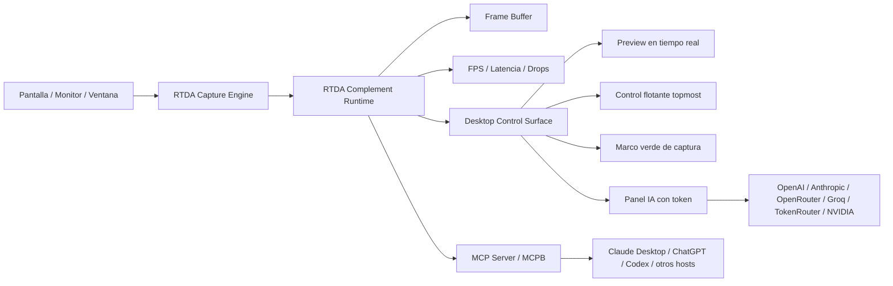

# Real-Time Desktop Agent


**Real-Time Desktop Agent (RTDA)** es un complemento local para asistentes de IA que necesitan observar y razonar sobre el escritorio en Windows 11. Su nucleo captura pantalla o ventanas, mantiene solo frames efimeros en memoria, mide rendimiento y expone esas capacidades por una frontera reutilizable.

El proyecto se usa de dos maneras:

- **RTDA Complement**: capa funcional para Claude Desktop, ChatGPT, Codex u otros hosts compatibles con MCP.
- **RTDA Desktop Control Surface**: app propia de escritorio para operar, visualizar y probar el complemento local con preview, metricas, overlay verde y panel IA con token.

RTDA esta pensado para desarrolladores, investigadores y builders que quieren crear agentes de escritorio locales, medir captura de baja latencia y exponer herramientas seguras a clientes de IA.

## Stack Tecnologico

| Area | Tecnologias reales |
| --- | --- |
| Frontend / UI |  dashboard local, preview, overlay y control flotante |
| Backend / Core |  `setuptools`, arquitectura `src/` |
| Computer Vision |    |
| Captura Windows | `windows-capture`, DXGI Desktop Duplication, Windows Graphics Capture, Win32 monitor/window APIs |
| IA / Agentes | Cliente multi-proveedor por HTTP, agente rule-based, MCP server |
| OCR | PaddleOCR/PaddlePaddle como extra opcional |
| Base de datos | No aplica actualmente |
| Infraestructura | Local-first; sin Docker ni despliegue remoto obligatorio |
| Herramientas |  `mcp`, `pyautogui`, `uiautomation` |

## Arquitectura



## Caracteristicas Principales

- Captura monitor, region o ventana especifica en Windows 11.
- Mantiene un frame buffer efimero, acotado y solo en memoria para consumo en tiempo real.
- Mide FPS, resolucion, latencia, frames descartados y errores.
- Expone mouse, teclado, vision y border desde una API de complemento.
- Muestra preview local con una interfaz de escritorio redisenada.
- Dibuja un marco verde para saber que area esta observando RTDA.
- Incluye un control flotante en segundo plano para ver estado e interactuar.
- Expone herramientas MCP para funcionar como complemento de asistentes IA.
- Permite pruebas con proveedores IA usando token en la app: OpenAI, Anthropic, OpenRouter, Groq, TokenRouter y NVIDIA.
- Mantiene acciones externas en modo seguro/dry-run mientras se endurece MVP.

## 🚀 Guía de Instalación y Distribución

> Consulta la [**Guía Completa de Instalación y Distribución (docs/INSTALLATION.md)**](docs/INSTALLATION.md) para ver los 3 métodos detallados de instalación con iconos e instrucciones paso a paso.

| Método | Destino | Tipo de Instalación | Instrucciones |
|---|---|---|---|
| 🟣 **Método A** | **Claude Desktop** | **1-Click MCP Bundle (`.mcpb`)** | Arrastrar `dist/real-time-desktop-agent-0.1.0.mcpb` a Claude Desktop |
| 🔵 **Método B** | **Cursor / VSCode / Dev** | **`pip` / `uv` local install** | `uv pip install -e .` + `claude_desktop_config.json` |
| 🔴 **Método C** | **ChatGPT / API / WebSocket** | **Servidor SSE en Red** | `python -m rtda.mcp.server --transport sse` |

---

## Instalación Básica de Desarrollo

1. Clona el repositorio.

```powershell
git clone https://github.com/Adan0423/real-time-desktop-agent.git
cd real-time-desktop-agent
```

2. Crea y activa un entorno virtual.

```powershell
python -m venv .venv
.\.venv\Scripts\Activate.ps1
```

3. Instala el proyecto para captura, UI y pruebas.

```powershell
python -m pip install -e ".[capture,gui,dev]"
```

4. Ejecuta la app propia con overlay verde y flotante.

```powershell
python -m desktop.main
```

5. Ejecuta la app sin overlay o sin flotante.

```powershell
python -m desktop.main --hide-overlay
python -m desktop.main --hide-floating
```

6. Lista monitores detectados.

```powershell
python -m rtda.app.main --list-monitors
```

7. Ejecuta diagnostico de captura.

```powershell
python -m rtda.app.main --capture-diagnostic --duration 4 --backend dxgi --target-fps 30
```

Para minimizar RAM, RTDA usa `--max-buffer-size 2` por defecto: conserva
solamente el frame actual y el anterior. Usa `--max-buffer-size 1` si no
necesitas deteccion de cambios.

8. Ejecuta el servidor MCP por stdio.

```powershell
python -m rtda.mcp.server --transport stdio
```

9. Consume RTDA como complemento desde Python.

```python
from rtda.complement import RTDAComplementRuntime
from rtda.capture.interface import CaptureConfig

runtime = RTDAComplementRuntime(CaptureConfig(backend="dxgi", target_fps=60))
runtime.start_capture()
observation = runtime.observe()
runtime.hotkey("ctrl", "l")
runtime.stop_capture()
```

10. Ejecuta pruebas.

```powershell
python -m pytest
```

## Variables de Entorno

RTDA no carga `.env` automaticamente. Usa estas variables si integras los clientes desde Python o si tu host MCP las inyecta.

| Variable | Descripcion | Requerida |
| --- | --- | --- |
| `OPENAI_API_KEY` | Token para llamadas al proveedor OpenAI desde `AIClientConfig.from_env()` | Opcional |
| `ANTHROPIC_API_KEY` | Token para llamadas al proveedor Anthropic desde `AIClientConfig.from_env()` | Opcional |
| `OPENROUTER_API_KEY` | Token para OpenRouter desde el panel IA o `AIClientConfig.from_env()` | Opcional |
| `GROQ_API_KEY` | Token para Groq desde el panel IA o `AIClientConfig.from_env()` | Opcional |
| `TOKENROUTER_API_KEY` | Token para TokenRouter desde el panel IA o `AIClientConfig.from_env()` | Opcional |
| `NVIDIA_API_KEY` | Token para NVIDIA NIM desde el panel IA o `AIClientConfig.from_env()` | Opcional |
| `RTDA_AI_PROVIDER` | Proveedor IA por defecto: `openai`, `anthropic`, `openrouter`, `groq`, `tokenrouter` o `nvidia` | Opcional |
| `RTDA_BACKEND` | Default documentado para captura (`dxgi`/`wgc`); usa `--backend` en CLI | Opcional |
| `RTDA_TARGET_FPS` | Default documentado de FPS; usa `--target-fps` en CLI | Opcional |
| `RTDA_MONITOR_INDEX` | Default documentado de monitor; usa `--monitor-index` en CLI | Opcional |

## Retencion de Datos

RTDA esta disenado para operar local-first y en tiempo real:

- No guarda capturas, screenshots ni frames en disco.
- El buffer de captura vive solo en RAM, usa `max_buffer_size=2` por defecto y tiene limite duro de `4`.
- `stop()` limpia el buffer para liberar los frames retenidos.
- Las metricas conservan solo contadores, latencia, resolucion y estado; no conservan imagenes.
- El cliente OpenAI envia `store=false` cuando se usa el panel IA.

## Estructura de Carpetas

```text
real-time-desktop-agent/
|-- src/rtda/
|   |-- ai/              # Cliente multi-proveedor usado por la app propia
|   |-- complement/      # API publica del complemento IA RTDA
|   |-- app/             # CLI launchers y shims de compatibilidad
|   |-- extension/       # Alias compatible hacia complement/
|   |-- capture/         # ScreenCapture, DXGI/WGC, buffer y diagnosticos
|   |-- overlay/         # Marco verde y geometria monitor/region/ventana
|   |-- perception/      # OpenCV, UIA, OCR y vision model adapters
|   |-- actions/         # Comandos, resolucion y executor PyAutoGUI
|   |-- safety/          # Politicas de riesgo y confirmacion
|   |-- agent/           # Observe -> plan -> act -> verify -> recover
|   |-- mcp/             # Servidor MCP para Claude/hosts compatibles
|   |-- models/          # Modelos de datos Pydantic/dataclasses
|   |-- performance/     # Metricas de captura y procesamiento
|   `-- state/           # Estado observable del agente
|-- desktop/             # App de escritorio separada: dashboard, floating y UI
|   |-- ui/              # Paneles/widgets PySide6 reutilizables
|   |-- dashboard.py     # Orquestador compacto de la ventana
|   |-- runtime_bridge.py # Adaptador hacia RTDAComplementRuntime
|   |-- ai_bridge.py     # Pruebas IA manuales con token
|   `-- floating.py      # Control flotante en segundo plano
|-- docs/                # Documentacion tecnica y roadmap
|-- tests/               # Suite pytest
|-- packaging/mcpb/      # Manifiesto base para Claude Desktop MCPB
|-- plugins/             # Plugin local ChatGPT/Codex
|-- .agents/plugins/     # Marketplace local para ChatGPT Desktop/Codex
|-- .env.example         # Variables opcionales de referencia
|-- mcpb_server.py       # Entrypoint stdio para bundle MCPB
|-- pyproject.toml       # Dependencias y metadata del paquete
`-- LICENSE              # Licencia MIT con autoria de Adan0423
```

## Roadmap / Estado

El estado por modulo vive en [docs/PROGRESS.md](docs/PROGRESS.md) y los pendientes priorizados en [docs/TODO.md](docs/TODO.md).

## Documentacion

- [Arquitectura](docs/ARCHITECTURE.md)
- [Estructura para desarrolladores](docs/STRUCTURE.md)
- [Progreso](docs/PROGRESS.md)
- [Agentes](docs/AGENTS.md)
- [Skills](docs/SKILLS.md)
- [Pendientes](docs/TODO.md)
- [Modos de uso](docs/modes.md)
- [Captura](docs/capture.md)
- [Overlay verde](docs/overlay.md)
- [IA con token](docs/ai.md)
- [MCP](docs/mcp.md)
- [Claude Desktop MCPB](docs/MCPB.md)
- [ChatGPT / Codex Plugin](docs/CHATGPT_PLUGIN.md)
- [Contribuir](CONTRIBUTING.md)

## Complementos IA

RTDA usa formatos distintos segun el host:

| Host | Formato | Ruta |
| --- | --- | --- |
| Claude Desktop | `.mcpb` | `dist/real-time-desktop-agent-0.1.0.mcpb` |
| ChatGPT / Codex | Plugin con `.codex-plugin/plugin.json` | `plugins/real-time-desktop-agent/` |
| MCP generico | MCP server stdio/HTTP/SSE | `python -m rtda.mcp.server` |

Claude Desktop instala complementos locales arrastrando un archivo `.mcpb`. `.dxt` fue el nombre anterior del formato; Anthropic recomienda `.mcpb` para paquetes nuevos.

RTDA incluye un manifiesto base en [packaging/mcpb/manifest.json](packaging/mcpb/manifest.json) y un entrypoint en [mcpb_server.py](mcpb_server.py). El empaquetado se genera con el CLI oficial `mcpb`.

```powershell
.\scripts\build_mcpb.ps1
```

Build local generada:

```text
dist/real-time-desktop-agent-0.1.0.mcpb
```

El paquete local no esta firmado; para distribucion publica conviene firmarlo y probar instalacion en Claude Desktop.

Para ChatGPT/Codex, RTDA incluye un plugin local en [plugins/real-time-desktop-agent](plugins/real-time-desktop-agent) y un marketplace repo en [.agents/plugins/marketplace.json](.agents/plugins/marketplace.json). Ver [docs/CHATGPT_PLUGIN.md](docs/CHATGPT_PLUGIN.md).

## Licencia y Contacto

Este proyecto es open source bajo licencia MIT.

Copyright (c) 2026 **Adan0423**.

Contacto configurado del proyecto: `Atrinidad.a4@gmail.com`.
