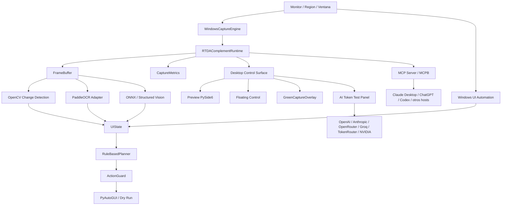
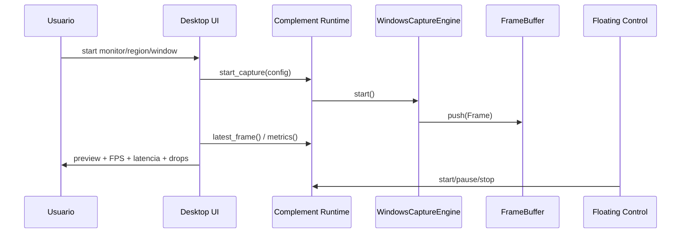
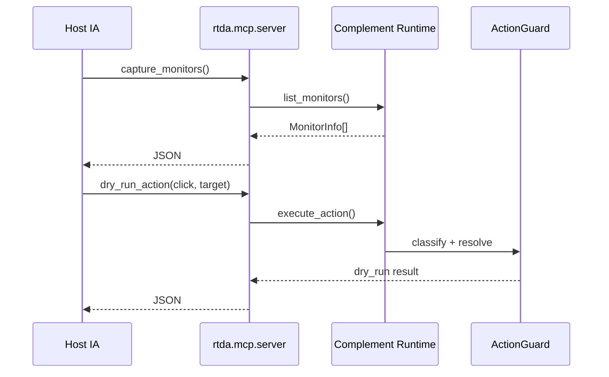

# Arquitectura

Ultima actualizacion: 2026-08-11

## Vision General

RTDA se organiza como un complemento local-first para IA, no como una app
monolitica. La regla de arquitectura es:

```text
RTDA Complement = capacidades avanzadas reutilizables
RTDA Desktop Control Surface = interfaz propia que consume esas capacidades
MCP/MCPB = transporte para hosts externos de IA
```

La app de escritorio existe para operar, visualizar y probar el complemento.
Claude Desktop, ChatGPT, Codex u otros hosts deben consumir RTDA por MCP o por
la frontera funcional del paquete, no por detalles internos de la UI.

## Diagrama General



## Capas

| Capa | Modulo | Responsabilidad |
| --- | --- | --- |
| Captura | `src/rtda/capture/` | Monitores, DXGI/WGC, frame buffer y metricas |
| Complemento | `src/rtda/complement/` | API publica para captura, vision, acciones y border |
| Compatibilidad | `src/rtda/extension/` | Alias para imports antiguos hacia `rtda.complement` |
| Escritorio | `desktop/` | Dashboard, preview, control flotante y panel de pruebas IA |
| Launchers | `src/rtda/app/` | CLI y shims de compatibilidad |
| Overlay | `src/rtda/overlay/` | Marco verde del area observada |
| MCP | `src/rtda/mcp/`, `mcpb_server.py` | Tools para hosts IA externos y bundle Claude Desktop |
| Percepcion | `src/rtda/perception/` | OpenCV, UIA, OCR y vision estructurada |
| Acciones | `src/rtda/actions/`, `src/rtda/safety/` | Resolucion de comandos, riesgo y dry-run |
| Agente | `src/rtda/agent/` | Observe, plan, act, verify y recovery deterministico |

## Decisiones Tecnicas

| Decision | Eleccion | Motivo |
| --- | --- | --- |
| Captura de monitor | DXGI Desktop Duplication via `windows-capture` | Baja latencia y buena estabilidad para escritorio Windows |
| Captura de ventana | Windows Graphics Capture via `windows-capture` | Soporta ventana especifica cuando Windows lo permite |
| Enumeracion de monitores | Win32 `EnumDisplayMonitors` / `GetMonitorInfoW` via `ctypes` | Evita depender del backend de captura para listar pantallas |
| Fachada del complemento | `RTDAComplementRuntime` | Separa capacidades de IA de la app de escritorio |
| UI local | PySide6 | Preview nativo, controles, overlay y flotante sin navegador |
| Control flotante | QWidget topmost sin borde | Permite ver estado e interactuar aunque la ventana principal este oculta |
| Overlay verde | QWidget transparente topmost | Da feedback visual inmediato de que area observa RTDA |
| Change detection | OpenCV + NumPy | Rapido, local y medible para diferencias entre frames |
| UI Automation | `uiautomation` | Lectura estructurada de controles Windows sin OCR |
| OCR | PaddleOCR opcional | Adapter listo, pero depende de entorno compatible |
| Vision local | ONNX Runtime adapter | Prepara una ruta para modelos locales sin fijar arquitectura aun |
| Acciones | PyAutoGUI detras de `ActionGuard` | Mantiene una frontera de seguridad y permite dry-run |
| Integracion externa | MCP | Protocolo estandar para que hosts IA consuman tools locales |
| IA app propia | HTTP stdlib hacia proveedores IA | Evita SDKs extra y facilita pruebas con transporte fake |

## Flujo de Captura



## Flujo MCP



## Fronteras de Seguridad

- MCP no ejecuta acciones reales: expone `dry_run_action`.
- `ActionGuard` clasifica acciones en `safe`, `moderate` y `dangerous`.
- Acciones destructivas como `delete`, `publish`, `send`, `purchase` y `submit`
  se tratan como peligrosas.
- El panel IA no recibe frames todavia; usa prompt y contexto textual de
  metricas.
- El control flotante solo llama operaciones de runtime: start, pause, stop,
  open y quit.

## Limitaciones Actuales

- La frontera `RTDAComplementRuntime` es in-process; falta opcion de runtime como
  proceso local persistente independiente de la app.
- No hay base de datos persistente.
- No hay CI/CD ni empaquetado release automatizado.
- El OCR real depende de una version de Python compatible con PaddlePaddle.
- El MCPB tiene manifiesto validado y paquete local generado; falta prueba
  manual de instalacion en Claude Desktop.
- La vision multimodal hacia proveedores IA todavia no envia imagen/frame.
