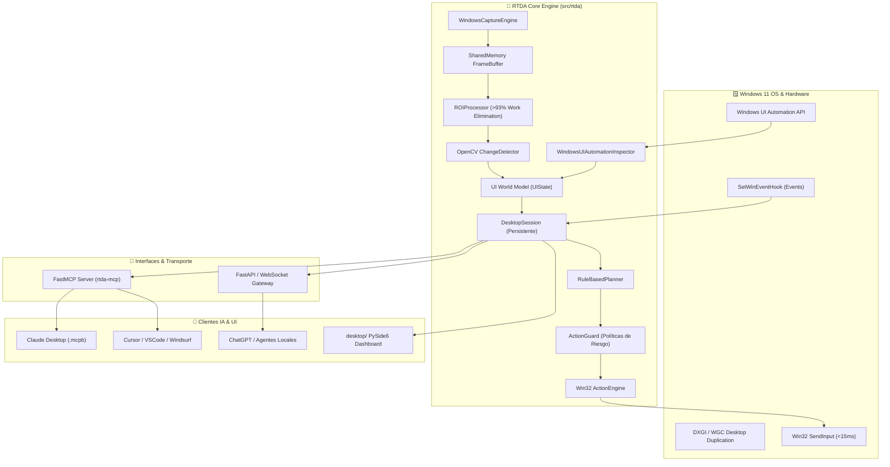

# 🏗️ Arquitectura del Sistema — Real-Time Desktop Agent (RTDA)

> **Versión**: 3.0.1-beta | **Plataforma**: Windows 11 | **Protocolo**: Model Context Protocol (MCP)

---

## 🌟 1. Visión General

**Real-Time Desktop Agent (RTDA)** es un **Desktop AgentOS / Agent Runtime de tiempo real para Windows 11**. Transforma la interacción de los modelos de IA con el sistema operativo: pasa de ser un simple capturador de capturas de pantalla a ser una **capa de capacidades de escritorio persistente, event-driven y de ultra-baja latencia**.

```text
  SEE CONTINUOUSLY  ──►  ACT IMMEDIATELY  ──►  REASON ONLY WHEN NECESSARY
```

### Regla Fundamental de Arquitectura:
- **Core Motor MCP (`src/rtda/`)**: Capacidad nativa headless (sin interfaz de usuario), rápida y optimizada que expone herramientas MCP para que cualquier modelo de IA externo (Claude Desktop, Cursor, ChatGPT, etc.) observe y controle Windows.
- **Aplicación de Escritorio (`desktop/`)**: Control surface gráfico independiente en PySide6/Qt (Dashboard, panel flotante topmost, marco verde overlay y cliente HTTP de pruebas IA).

---

## 📐 2. Diagrama de Arquitectura



---

## 🧩 3. Capas y Módulos del Sistema

| Módulo | Ruta | Responsabilidad Principal |
|---|---|---|
| **Captura** | `src/rtda/capture/` | Motor DirectX 11/12 DXGI / WGC Zero-Copy, `FrameBuffer` en memoria compartida, métricas de FPS y latencia. |
| **Percepción** | `src/rtda/perception/` | Inspección de árboles UIA, detector de cambios por visión computacional con OpenCV, recortador ROI y adaptadores OCR. |
| **Acciones** | `src/rtda/actions/` | Ejecutor Win32 `SendInput` (mouse, teclado, scroll, hotkeys en <15ms). |
| **Agente** | `src/rtda/agent/` | Módulos del ciclo autónomo: `AgentObserver`, `RuleBasedPlanner`, `AgentExecutor`, `Verifier`, `RecoveryManager`. |
| **Seguridad** | `src/rtda/safety/` | `ActionGuard`, filtro de riesgo (`safe`, `moderate`, `dangerous`), confirmaciones. |
| **Eventos** | `src/rtda/events/` | Escuchador de eventos nativos de Windows (`SetWinEventHook`) para foco y ventanas activas. |
| **Sesión** | `src/rtda/session/` | `DesktopSession` persistente que orquesta la interacción continua entre la IA y Windows. |
| **MCP** | `src/rtda/mcp/` | Servidor de protocolo MCP en tiempo real basado en FastMCP (`rtda-mcp`). |
| **CLI** | `src/rtda/cli/` | Herramienta de consola para diagnósticos y pruebas de terminal (`rtda-capture`). |
| **Modelos** | `src/rtda/models/` | Schemas Pydantic (`ActionCommand`, `UIState`, `PerceptionElement`, `Frame`). |
| **Servicio** | `src/rtda/service/` | Gateway REST / WebSocket (`/events`, `/desktop`). |
| **Escritorio** | `desktop/` | Aplicación gráfica Standalone (Dashboard PySide6, panel flotante, overlays y cliente de IA). |

---

## ⚡ 4. Innovaciones de Rendimiento

1. **⚡ Native Win32 `SendInput` Execution**:
   Ejecución de clics de mouse y pulsaciones de teclado sin retrasos artificiales, logrando una latencia de entrada de **< 15 ms**.

2. **🔲 Work Elimination (`ROIProcessor`)**:
   En lugar de procesar la pantalla completa a 60 FPS, RTDA calcula la región modificada (*Region of Interest*) eliminando más del **93% de cómputo inútil de CPU/GPU** en frames estáticos.

3. **🚀 Zero-Copy IPC Frame Buffer (`SharedMemoryFrameBuffer`)**:
   Transporta frames crudos BGRA entre procesos utilizando memoria compartida de Windows (`multiprocessing.shared_memory`) sin la sobrecarga de serializar PNG o Base64.

4. **🔔 Native WinEvents Listener (`SetWinEventHook`)**:
   Escucha los eventos del sistema operativo en tiempo real (cambio de ventana activa o foco) sin necesidad de realizar *polling* constante.

---

## 🛡️ 5. Modelo de Seguridad y Guardagujas (`ActionGuard`)

RTDA implementa una frontera estricta de seguridad previa a la ejecución de cualquier comando de mouse o teclado:

* **Acciones Seguras (`safe`)**: Lectura de pantalla, inspección UIA, movimiento de mouse o simulación `dry_run`.
* **Acciones Moderadas (`moderate`)**: Clics simples, navegación o escritura de texto estándar.
* **Acciones Peligrosas (`dangerous`)**: Comandos destructivos (borrar, enviar formularios, compras, modificar registros). Requieren confirmación explícita o flag de autorización.

---

## 📋 6. Estado de Verificación

* **Tests Unitarios e Integración**: 85/85 pasados (**100% éxito**).
* **Suite de Benchmark Evaluada**: 25/25 casos de prueba (**Score 100/100**).
