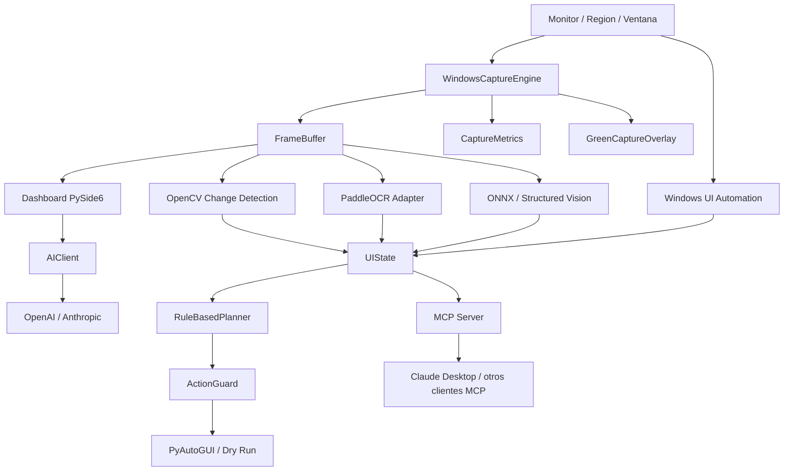
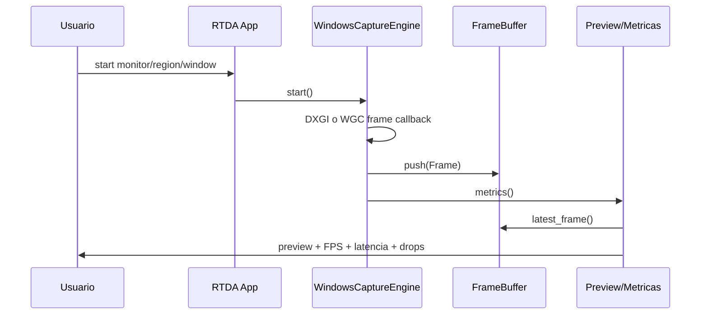
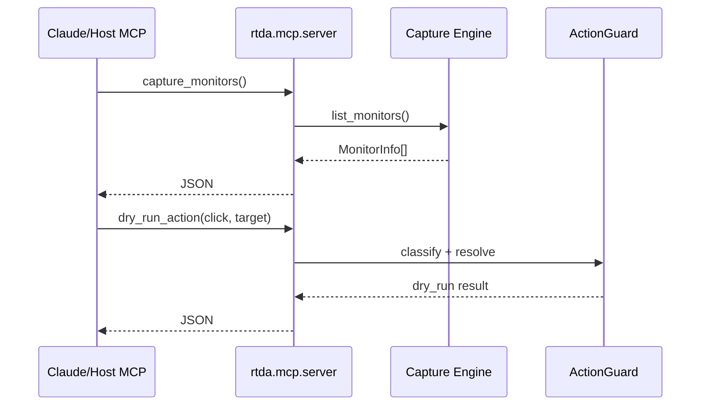

# Arquitectura

Ultima actualizacion: 2026-08-11

## Vision General

RTDA es una aplicacion local-first para Windows 11. Su nucleo captura pantalla,
mantiene frames recientes en memoria, mide rendimiento y expone la observacion a
dos superficies:

- app propia con preview, overlay verde y panel IA;
- servidor MCP para Claude Desktop, ChatGPT u otros hosts compatibles.

## Diagrama General

## Decisiones Tecnicas

| Decision | Eleccion | Motivo |
| --- | --- | --- |
| Captura de monitor | DXGI Desktop Duplication via `windows-capture` | Baja latencia y buena estabilidad para escritorio Windows |
| Captura de ventana | Windows Graphics Capture via `windows-capture` | Soporta ventana especifica cuando Windows lo permite |
| Enumeracion de monitores | Win32 `EnumDisplayMonitors` / `GetMonitorInfoW` via `ctypes` | Evita depender del backend de captura para listar pantallas |
| UI local | PySide6 | Permite preview, controles y overlay sin navegador |
| Overlay verde | QWidget transparente topmost | Da feedback visual inmediato de que area observa RTDA |
| Change detection | OpenCV + NumPy | Rapido, local y medible para diferencias entre frames |
| UI Automation | `uiautomation` | Lectura estructurada de controles Windows sin OCR |
| OCR | PaddleOCR opcional | Adapter listo, pero depende de entorno compatible |
| Vision local | ONNX Runtime adapter | Prepara una ruta para modelos locales sin fijar arquitectura aun |
| Acciones | PyAutoGUI detras de `ActionGuard` | Mantiene una frontera de seguridad y permite dry-run |
| Integracion externa | MCP | Protocolo estandar para que hosts IA consuman tools locales |
| IA app propia | HTTP stdlib hacia OpenAI/Anthropic | Evita SDKs extra y facilita pruebas con transporte fake |

## Flujo de Captura

## Flujo MCP

## Fronteras de Seguridad

- MCP no ejecuta acciones reales: expone `dry_run_action`.
- `ActionGuard` clasifica acciones en `safe`, `moderate` y `dangerous`.
- Acciones destructivas como `delete`, `publish`, `send`, `purchase` y `submit`
  se tratan como peligrosas.
- El panel IA no recibe frames todavia; usa prompt y contexto textual de
  metricas.

## Limitaciones Actuales

- No hay base de datos persistente.
- No hay CI/CD ni empaquetado release automatizado.
- El OCR real depende de una version de Python compatible con PaddlePaddle.
- El MCPB tiene manifiesto base, pero el paquete `.mcpb` final debe validarse
  con el CLI oficial `mcpb`.
- La vision multimodal hacia OpenAI/Anthropic todavia no envia imagen/frame.
